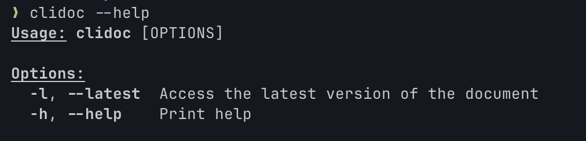

# Connecting the client docs

[![License][crates-badge]][crates-url]
[![MIT licensed][mit-badge]][mit-url]

[crates-badge]: https://img.shields.io/crates/v/clidoc.svg
[crates-url]: https://crates.io/crates/clidoc
[mit-badge]: https://img.shields.io/badge/license-MIT-blue.svg
[mit-url]: https://gihtub.com/335g/clidoc/blob/master/LICENSE

CLI for immediate access to Client documentation in various aws-sdk-xxx

## Installing

```bash
cargo install clidoc
```

## Commands



## License

[MIT License](./LICENSE)

